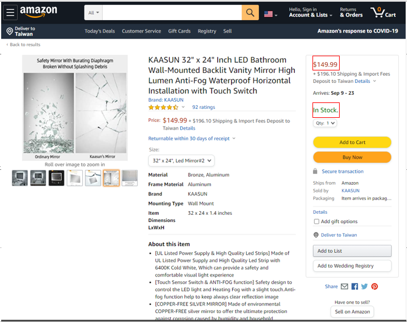

# Scrape-with-Proxy
Scraping script that fetches prices on listings that are only in stock from Amazon with the usage of Proxy Rotation and User Agents

# Inspiration
Because Amazon API was announced to be closed for developer, I could only use Selenium to fetch information I need to from a listing on Amazon

# Goal
The main goal when writing this script is that we do not want prices of an item that is either out of stock, minimum quantity items (items that needs to be purchased 2 or more quantity), maximum quantity items (items that can only be purchased with a fixed quantity) or items that are not Prime (items with more than 2 days shipping)

# Import File
The imported file (file_with_skus) from the code is merely a list of Amazon skus that correspond to the listings needed to run the scrape on

# Proxy and User Agents
The proxies shown in the script are private proxies purchased on MyPrivateProxy (that no longer works anymore, only used for demonstration) and User Agents are from the website https://developers.whatismybrowser.com/useragents/explore/
